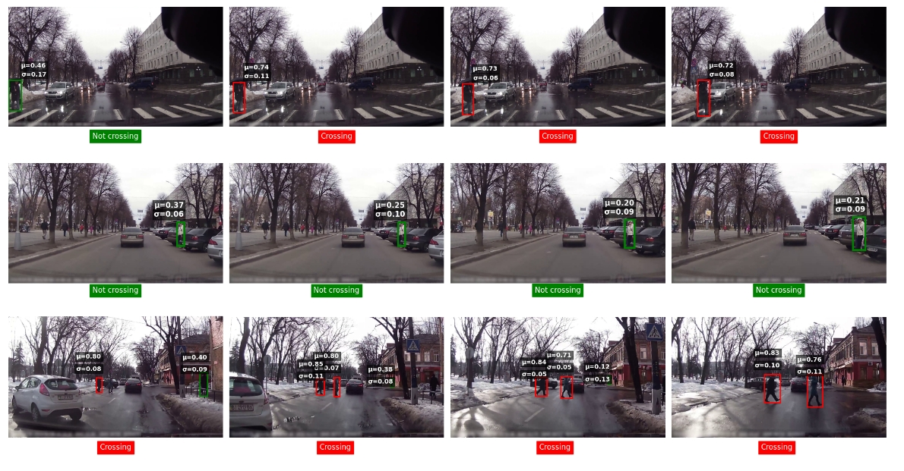
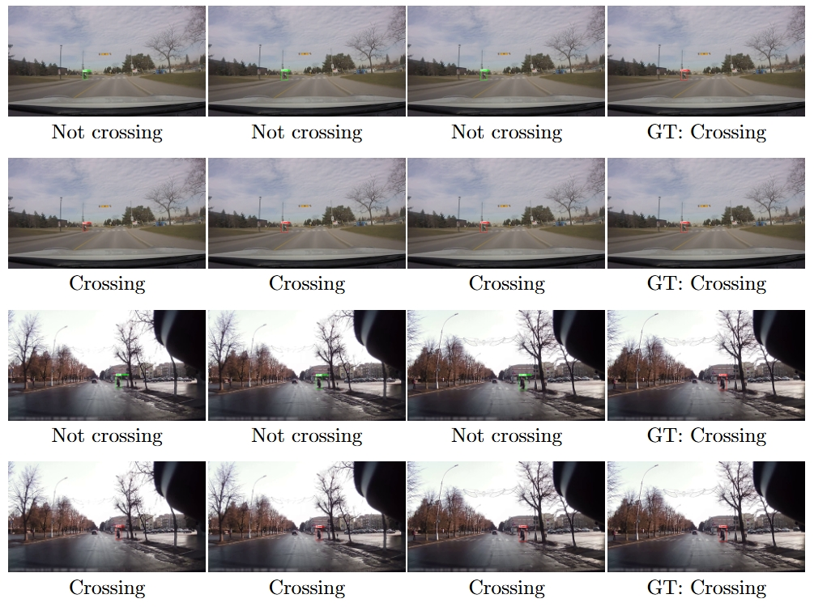

# FPCIP
Fast Pedestrian Crossing Intention Prediction via Parameterized View Normalization and Uncertainty Estimation

We introduce a fully learnable view–normalization module that replaces fixed geometric priors with trainable depth‐scaling parameters and adaptive fusion weights, effectively correcting perspective and distance‐induced motion artifacts...
 

The code will be coming soon. Stay tuned!
